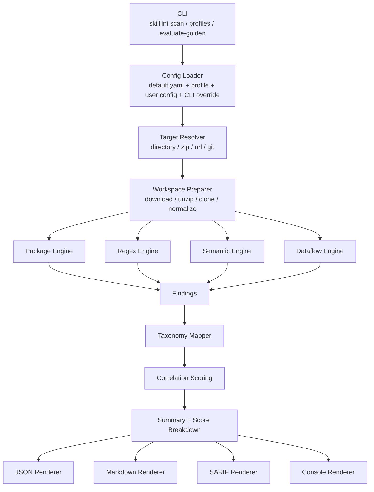

# SkillLint 系统设计与实现说明

- 项目：SkillLint
- 日期：2026-04-14
- 状态：Implemented Baseline

## 1. 文档目的

本文档面向人类开发者，帮助快速理解 SkillLint 当前的：

1. 设计目标与设计原则；
2. 核心架构与处理链路；
3. 主要模块的设计与实现逻辑；
4. 为什么采用当前方案，而不是其他可选方案；
5. 当前方案的优缺点与后续演进方向。

---

## 2. SkillLint CLI 的设计目标和原则

## 2.1 设计目标

SkillLint 当前是一个 **CLI-first** 的 skill 安全扫描器，目标不是做“通用代码审计平台”，而是围绕 **agent skill / skill package** 场景做高价值检测。

当前阶段的核心目标是：

1. 能扫描多种输入形态的 skill：
   - 本地目录
   - zip 包
   - URL
   - git repo URL
2. 以统一的数据结构输出风险结果：
   - JSON
   - Markdown
   - SARIF
3. 支持多种检测方式组合：
   - package
   - regex
   - semantic
   - dataflow
   - optional LLM
4. 尽量给出**可定位、可解释、可复现**的结果：
   - 文件路径
   - 行号
   - snippet
   - rule_id
   - taxonomy
5. 能支持后续工程化演进：
   - baseline / regression
   - golden evaluation
   - rule filtering / profiles
   - marketplace 审核 / CI 集成

## 2.2 设计原则

### 1）Normalize First
先把输入转成统一工作区，再交给所有检测器。

这样避免每个引擎都重复处理“目录/zip/URL/git”差异。

### 2）Engine Separation
每种检测方式都独立实现，引擎之间只通过统一的 `Finding` 结构协作。

这样更容易：
- 单独调试某个引擎
- 单独调优误报
- 单独做 profile 开关

### 3）Evidence First
即使是语义类判断，也尽量回到具体片段和行号。

原因是：
- 安全工具最终要给人看
- 没有证据的 finding 很难被信任
- 也不利于后续 SARIF / baseline / diff

### 4）LLM as Analyzer, not Oracle
LLM 只作为增强分析器，不是唯一裁决者。

原因是：
- LLM 成本与延迟不稳定
- 结果可能不完全可复现
- 需要保留纯静态/本地模式

### 5）Rule Metadata / Detection Logic 分离
规则元数据放在 YAML，检测逻辑在 Python。

这样可以兼顾：
- 稳定 `rule_id`
- 统一 severity/taxonomy/remediation
- 不同引擎使用相同 reporting / profile / SARIF 机制

---

## 3. 系统架构图

下面是当前实现对应的核心架构图。



---

## 4. 上层处理逻辑

一次 `skilllint scan <target>` 的主流程如下：

1. **CLI 接收用户输入**
   - target
   - profile
   - rule filter
   - output format
   - LLM 参数
2. **配置合并**
   - 默认配置
   - profile preset
   - 用户 config 文件
   - CLI 最终覆盖
3. **解析 target 类型**
   - 判定是 directory / zip / url / git
4. **准备工作区**
   - 下载 / 解压 / clone / copy
   - 统一到 `.skilllint-work/scan-<id>/normalized`
5. **运行检测引擎**
   - package
   - regex
   - semantic
   - dataflow
6. **统一 finding 结构**
   - 补 taxonomy
   - 做 correlation
   - 计算 summary / score
7. **输出结果**
   - JSON
   - Markdown
   - SARIF
   - console summary

这条链路的设计重点在于：

- 前半段解决输入异构问题；
- 中间段解决多引擎并行发现问题；
- 后半段解决统一解释与输出问题。

---

## 5. 主要模块设计与实现逻辑

## 5.1 CLI 与配置层

涉及文件：
- `src/skilllint/cli.py`
- `src/skilllint/config.py`

### 职责

CLI 层负责：
- 接收用户命令
- 做参数合法性校验
- 组装最终 `SkillLintConfig`
- 调用 `SkillScanner`
- 选择输出 renderer

配置层负责：
- 定义统一配置模型
- 管理 profile preset
- 合并默认配置、用户配置和 CLI 覆盖

### 为什么这样设计

#### 当前方案
CLI 不直接承担扫描逻辑，只负责：
- 配置
- 参数
- 调用入口

#### 优点
- CLI 很薄，便于维护
- 后续可复用 `SkillScanner` 到 API / GUI / service
- 测试时可以直接绕开 CLI，测 scanner 和 engine

#### 替代方案
把扫描逻辑都直接写在 CLI 命令里。

#### 缺点
- 逻辑耦合
- 难测试
- 后续难扩展到非 CLI 场景

因此当前分层更合理。

---

## 5.2 Target Resolver 与 Workspace

涉及文件：
- `src/skilllint/inputs/resolver.py`
- `src/skilllint/core/workspace.py`

### 职责

#### Resolver
只做“输入类型识别”：
- 目录
- zip
- URL
- git URL

#### Workspace
做“实际物理准备”：
- copy 目录
- unzip
- download
- shallow clone
- 统一工作区

### 为什么这样设计

这是典型的“识别”和“执行”分离。

#### 优点
- resolver 简单，稳定
- workspace 能独立管理临时目录
- 所有引擎都只看 `normalized_dir`

#### 替代方案
每个引擎各自处理 URL / zip / git。

#### 缺点
- 重复代码极多
- 行为不一致
- 很难保证 output path / evidence path 统一

所以 current workspace-first 是必要的。

---

## 5.3 Rule Catalog / Repository

涉及文件：
- `src/skilllint/rules/repository.py`
- `src/skilllint/rules/*/rules.yaml`

### 职责

这一层统一维护规则元数据：
- `rule_id`
- `title`
- `severity`
- `taxonomy`
- `confidence`
- `tags`
- `explanation`
- `remediation`

### 为什么这样设计

#### 当前方案
- YAML 管规则元数据
- Python 管检测逻辑

#### 优点
- `rule_id` 稳定
- 报告、SARIF、profile、测试共用一套元数据
- 改说明文字/风险级别不一定要改检测代码

#### 替代方案 A
完全把规则写死在引擎代码里。

缺点：
- 难维护
- 难统一导出 rule catalog
- 不利于后续 custom rules

#### 替代方案 B
把检测逻辑也全部配置化。

缺点：
- 对 package/dataflow/semantic 这类复杂逻辑不现实
- 表达力不足

所以当前方案在“灵活性”和“工程复杂度”之间较平衡。

---

## 5.4 Scanner 编排层

涉及文件：
- `src/skilllint/core/scanner.py`

### 职责

Scanner 是系统编排器，负责：
- 调用 workspace
- 按顺序执行引擎
- 统一做 taxonomy 映射
- 做 correlation scoring
- 构造 `ScanResult`

### 为什么这样设计

Scanner 不做具体检测，只做 orchestration。

#### 优点
- 引擎可以独立演进
- 输出结构统一
- 更利于测试“单引擎 vs 全链路”

#### 当前执行顺序
1. package
2. regex
3. semantic
4. dataflow

这里顺序不是随机的：
- semantic 可以复用前序 finding 作为 seed
- 整体结果更稳定

#### 替代方案
让所有引擎完全并行、互不依赖。

#### 缺点
- semantic 无法利用 seed finding
- 结果解释性变差
- 顺序不稳定时会影响可复现性

---

## 5.5 Package Engine

涉及文件：
- `src/skilllint/engines/package_engine.py`

### 目标

从“skill 包里带了什么”这个角度发现风险。

这和代码语义分析不同，它更偏：
- 包结构
- 分发内容
- 供应链
- 自动执行载体

### 当前实现逻辑

主要检查：
- `SKILL.md` 缺失 / 多个
- symlink
- 隐藏文件
- archive / binary
- install/bootstrap script
- startup artifact
- `package.json` lifecycle script
- remote / VCS dependency
- `requirements*.txt` / `pyproject.toml` 远程依赖
- GitHub Actions 风险
- Dockerfile remote bootstrap

### 为什么这样设计

#### 优点
- 对 marketplace / 分发审核非常实用
- 不依赖复杂语义理解
- 对“包里藏东西”的风险特别有效

#### 替代方案
只分析 `SKILL.md` 和脚本文本，不看包结构。

#### 缺点
- 很容易漏掉：
  - symlink
  - 二进制
  - workflow
  - Dockerfile
  - manifest 自动执行链

所以 package engine 是 skill 场景下非常必要的一层。

---

## 5.6 Regex Engine

涉及文件：
- `src/skilllint/engines/regex_engine.py`

### 目标

用低成本识别高置信危险模式。

### 当前适合的场景

- `curl | sh`
- prompt injection 关键词
- secret path access
- dangerous shell exec
- reverse shell
- destructive file operation

### 为什么这样设计

#### 优点
- 快
- 稳
- 易解释
- 易做回归测试

#### 缺点
- 容易被变形绕过
- 只适合明确模式
- 语义理解弱

#### 替代方案
完全不用 regex，全交给 semantic/LLM。

#### 缺点
- 成本更高
- 结果更不稳定
- 不利于 SARIF / 基线

所以 regex 仍然是基础层。

---

## 5.7 Semantic Engine

涉及文件：
- `src/skilllint/engines/semantic_engine.py`
- `src/skilllint/engines/llm_analyzer.py`

### 目标

解决 regex 难处理的“组合语义”问题，例如：
- 隐蔽行为
- 伪装外传
- trigger hijack
- permission drift
- remote dynamic instructions

### 当前实现分两层

#### 第一层：本地语义规则
- keyword groups
- `all_of` / `any_of` 组合
- suppression heuristics
- 特殊复合逻辑（如 permission drift）

#### 第二层：可选 LLM
- 只分析少量可疑候选片段
- 输出 plain-language semantic label
- 本地映射成稳定 taxonomy / rule_id

### 为什么不让 LLM 直接输出内部 taxonomy 编码

因为内部 taxonomy 是 SkillLint 自己的编码体系，外部模型不天然理解。

直接让模型输出 `SLT-A01` 之类编码的风险是：
- 漂移
- 硬猜
- 稳定性差

所以当前设计是：

```text
LLM -> plain-language label -> local mapping -> stable finding
```

#### 优点
- 内部编码稳定
- 便于后续重构 taxonomy
- 可审计、可测试

#### 替代方案
让模型直接输出完整 finding + taxonomy。

#### 缺点
- 更依赖模型记忆
- 更难回归测试
- 更容易出现不可控漂移

---

## 5.8 Dataflow Engine

涉及文件：
- `src/skilllint/engines/dataflow_engine.py`

### 目标

检测 source → sink 风险链。

### 当前实现策略

#### Python
- 用 AST
- 维护轻量 taint
- 识别：
  - env / secret file / path 读取
  - network sink
  - exec sink

#### Shell
- 用模式组合启发式
- 识别：
  - secret-like source
  - network sink
  - exec primitive

#### JS/TS
- 用语句块 + 模式 + 简单 taint
- 识别：
  - `process.env`
  - `.env` 文件读取
  - network / exec sink

### 为什么不用完整静态分析框架

#### 当前方案
采用实用型 dataflow，而不是完整编译器/跨文件静态分析。

#### 优点
- 实现成本低很多
- 对 skill/helper 脚本这种短代码很有效
- 误报可控、易解释

#### 缺点
- 跨文件传播弱
- alias analysis 弱
- 复杂对象字段传播弱

#### 替代方案
完整静态分析 / SSA / CFG / interprocedural analysis。

#### 优点
- 理论上更强

#### 缺点
- 工程复杂度非常高
- 多语言成本高
- 对当前 SkillLint 阶段性目标不经济

所以当前 dataflow 方案是面向现实落地的折中。

---

## 5.9 Correlation Scoring

涉及文件：
- `src/skilllint/scoring.py`

### 目标

单条 finding 不一定足够说明真实风险，但多个信号组合在一起时，风险会明显提升。

例如：
- secret read + external send
- priority override + outbound send
- dangerous exec + destructive file ops

### 当前实现

- 按文件聚合 findings
- 匹配 correlation patterns
- 生成：
  - correlation hits
  - 部分 synthetic findings
- 最终计算：
  - base score
  - correlation score
  - aggregate score
  - verdict

### 为什么这样设计

#### 优点
- 能表达“组合风险”
- 比单条规则更接近真实威胁链
- 仍保持结果可解释

#### 替代方案
只按最大 severity 给结论。

#### 缺点
- 无法区分“单点高危”与“多信号闭环”
- 容易低估组合攻击链

---

## 5.10 Reporting 层

涉及文件：
- `src/skilllint/reporting/json_renderer.py`
- `src/skilllint/reporting/markdown_renderer.py`
- `src/skilllint/reporting/sarif_renderer.py`
- `src/skilllint/reporting/console_renderer.py`

### 目标

同一份 `ScanResult` 面向不同消费方输出不同格式。

### 为什么这么设计

#### 当前方案
先统一构造 `ScanResult`，再由 renderer 做格式化。

#### 优点
- renderer 只关心展示，不关心检测逻辑
- JSON / Markdown / SARIF 行为一致
- 更容易补新输出格式

#### 替代方案
每个引擎分别生成自己的输出。

#### 缺点
- 格式不统一
- 字段难对齐
- 不利于测试和后期演进

### 当前 Markdown 渲染思路

Markdown 报告面向人工阅读，当前强化了：
- overview
- severity/taxonomy tables
- top findings
- per-finding structured table

这比单纯 bullet list 更适合人工审阅和留档。

---

## 6. 为什么当前整体方案适合 SkillLint

从工程角度看，SkillLint 当前采用的是一种 **分层、可解释、可渐进增强** 的架构。

它的最大特点不是“理论最强”，而是：

1. **能工作**：CLI 已可用；
2. **能解释**：每层都有证据与稳定结构；
3. **能回归**：有 golden evaluation / baseline；
4. **能扩展**：规则、profile、detector、renderer 都可继续加；
5. **能平衡成本**：LLM 只做必要增强，不主导整条链路。

如果一开始就走：
- 完整静态分析平台
- 全量 LLM 审核
- 全 marketplace 托管服务

工程成本会大幅上升，而且短期内很难形成稳定 baseline。

所以当前设计更符合 SkillLint 现在的阶段目标。

---

## 7. 当前方案的优缺点总结

## 优点

- 输入统一，链路清晰
- 多引擎职责分明
- 结果结构稳定
- 证据定位较强
- 易做 profile / rule filter / SARIF / baseline
- 便于逐步引入更强的 LLM / detector

## 缺点

- semantic 仍有误报/漏报空间
- dataflow 不是完整跨文件分析
- package/workflow/Dockerfile 分析仍偏启发式
- LLM workflow 还比较基础
- taxonomy / SARIF 生态集成仍可继续深化

---

## 8. 后续建议

下一阶段最值得继续增强的是：

1. 更大的真实样本 baseline / regression 体系；
2. richer LLM semantic workflow；
3. external custom rule pack；
4. detector-level 评估仪表；
5. cross-skill / reputation 分析；
6. 更深的 GitHub Actions / Dockerfile / pyproject 语义分析。
