## Instructions

Flowcharts are composed of nodes (geometric shapes) and edges (arrows or lines). The Mermaid code defines how nodes and edges are made and accommodates different arrow types, multi-directional arrows, and any linking to and from subgraphs.

### Syntax

- Use `flowchart` or `graph` keyword
- Direction: `TD`/`TB` (Top to Bottom), `BT` (Bottom to Top), `RL` (Right to Left), `LR` (Left to Right)
- Node shapes:
  - Default: `A` or `A["Text"]`
  - Round edges: `A("Text")`
  - Stadium: `A(["Text"])`
  - Subroutine: `A[["Text"]]`
  - Cylindrical: `A[("Text")]`
  - Circle: `A(("Text"))`
  - Asymmetric: `A>"Text"]`
  - Rhombus: `A{"Text"}`
  - Hexagon: `A{{"Text"}}`
  - Parallelogram: `A[/"Text"/]` or `A[\"Text"/]`
  - Parallelogram alt: `A[/"Text"\]` or `A[\"Text"\`
  - Trapezoid: `A[/"Text"\]` or `A[\"Text"\`
  - Trapezoid alt: `A[/"Text"/]` or `A[\"Text"/]`
  - Double circle: `A((("Text")))`
  - New shapes (v11.3.0+): `A@{ shape: shapeName }` (e.g., `bang`, `cloud`, `diamond`, `cylinder`, etc.)
- Edges:
  - `A --> B` - Arrow with arrowhead
  - `A --- B` - Open link
  - `A -->|label| B` - Link with label
  - `A -.-> B` - Dotted link
  - `A -.->|label| B` - Dotted link with label
  - `A ==> B` - Thick link
  - `A ==|label|==> B` - Thick link with label
- Subgraphs: `subgraph id ["Title"] ... end`
- Styling: `style A fill:#color,stroke:#color` or `classDef className fill:#color` and `class A className` or `A:::className`
- Links: `linkStyle 0 stroke:#color` (0-based index)
- Comments: `%% comment` (on separate line)
- FontAwesome icons: `A[fa:fa-icon-name]`
- Custom icons: `A[fak:fa-custom-icon-name]` (requires FontAwesome kit)
- Click events: `click A callback "tooltip"` or `click A href "url" "tooltip"`
- Line curves: `curve: basis|bumpX|bumpY|cardinal|catmullRom|linear|monotoneX|monotoneY|natural|step|stepAfter|stepBefore`
- Edge IDs (v11.10.0+): `A -->|label|e1[ID] B` then `e1.curve = "stepBefore"`

**Warnings:**
- If using "end" in a node, capitalize it (e.g., "End" or "END")
- If using "o" or "x" as first letter, add space or capitalize (e.g., "dev--- ops" or "dev---Ops")

Reference: [Mermaid Flowchart Documentation](https://mermaid.ai/open-source/syntax/flowchart.html)

### Example (Basic Flowchart)

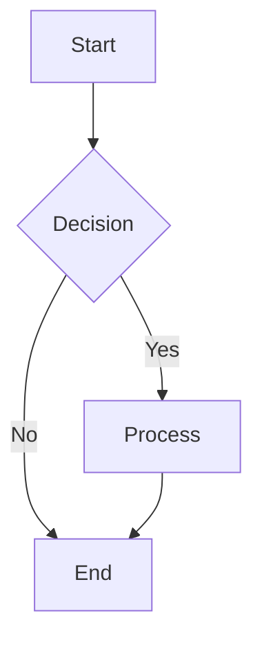

### Example (With Different Directions)

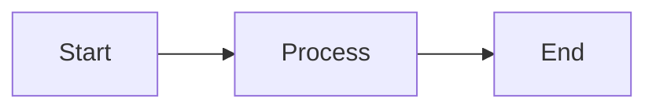

### Example (With Node Shapes)

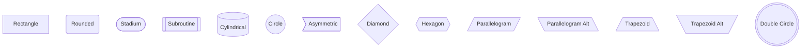

### Example (With Labels on Edges)

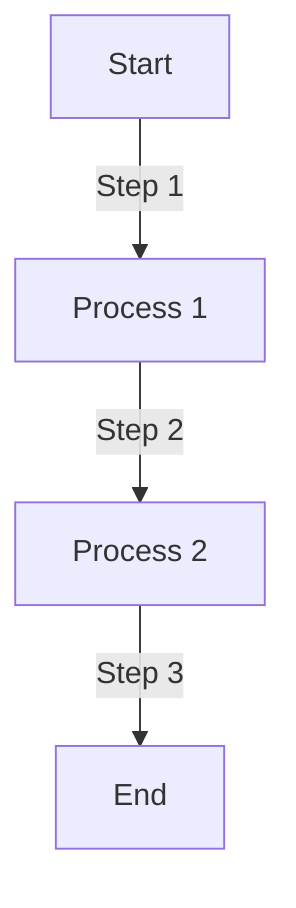

### Example (With Subgraphs)

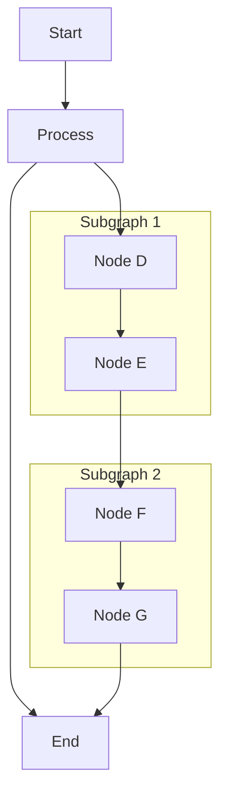

### Example (With Styling)

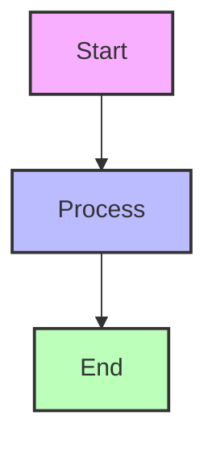

### Example (With Class Definitions)

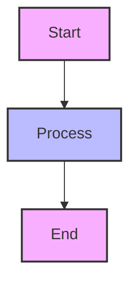

### Example (With Class Shorthand)

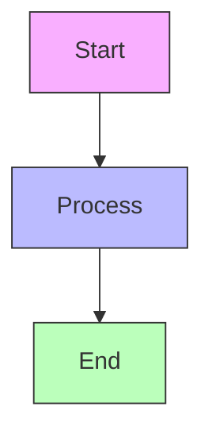

### Example (With Dotted Links)

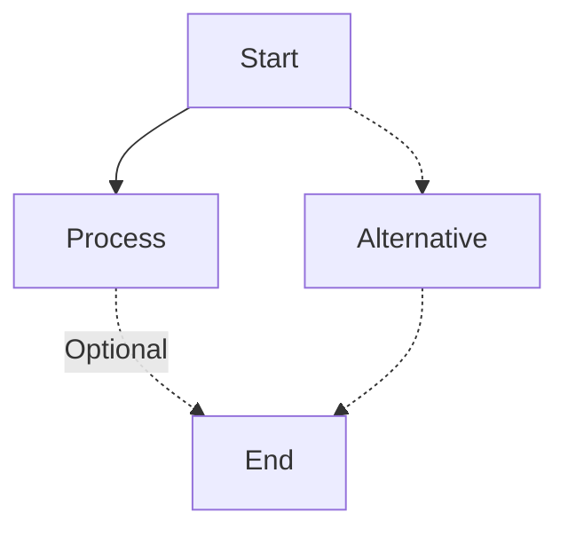

### Example (With Thick Links)

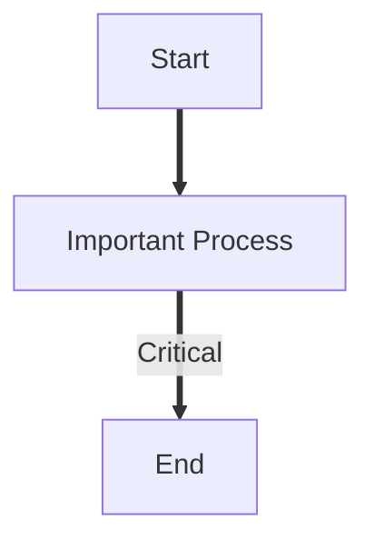

### Example (With FontAwesome Icons)

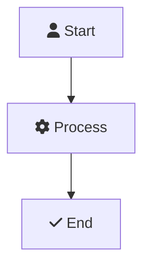

### Example (Complex Flowchart)

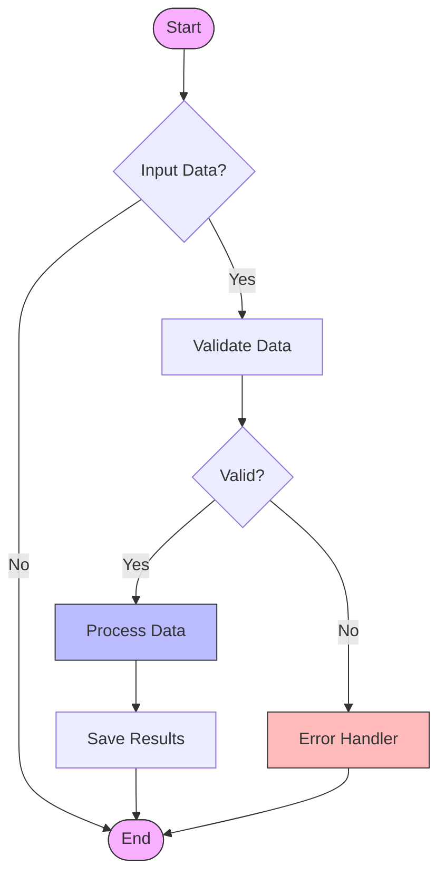

### Example (With Multiple Paths)

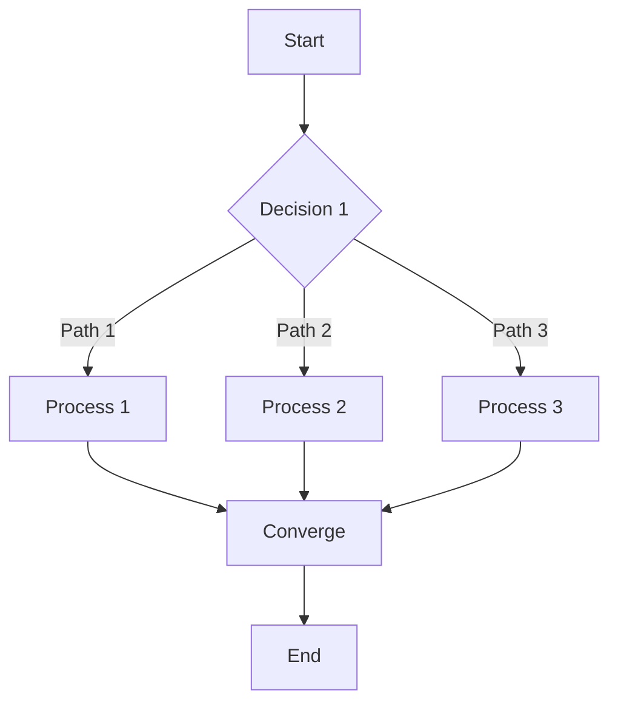

### Example (With Comments)

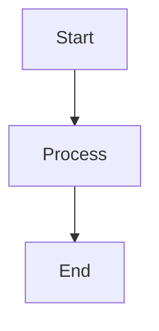

### Example (With Edge Styling)

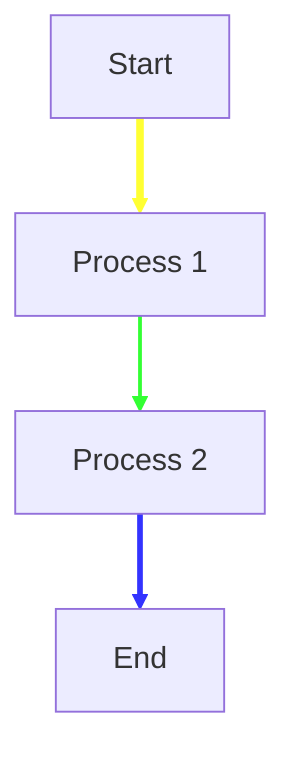

### Example (With New Shapes - v11.3.0+)

**Note**: New shapes require Mermaid v11.3.0+. If your environment doesn't support new shapes, use traditional shapes instead.

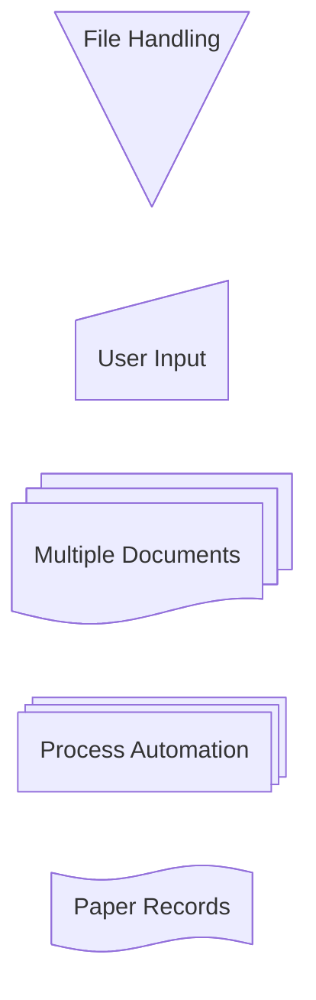

### Example (With Edge IDs and Curve Styles - v11.10.0+)

**Note**: Edge ID syntax requires Mermaid v11.10.0+. If your environment doesn't support edge IDs, use linkStyle instead (shown in alternative below).

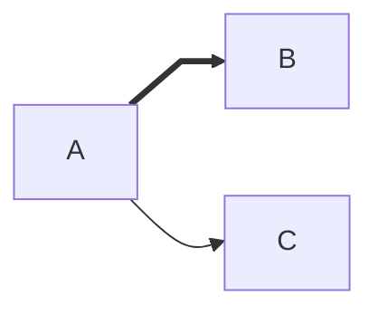

**Alternative (Using linkStyle - Compatible with all versions):**

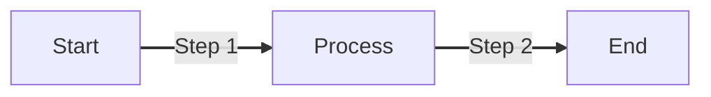

### Example (With Unicode Text)

Use quotes to enclose unicode text in nodes:

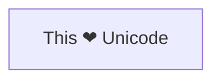

### Example (With Markdown Formatting)

Use double quotes and backticks to enclose markdown text:

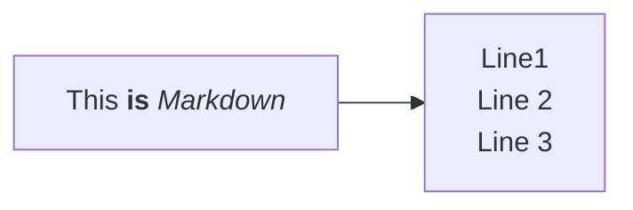

### Example (With Invisible Links)

Use `~~~` to create invisible links for positioning:

```mermaid
flowchart LR
    A ~~~ B
    B --> C
```

### Example (With Multi-directional Arrows)

Use circle and cross edge types for multi-directional arrows:

```mermaid
flowchart LR
    A o--o B
    B <--> C
    C x--x D
```

### Example (With Circle and Cross Edges)

Use `--o` for circle edge and `--x` for cross edge:

```mermaid
flowchart LR
    A --o B
    C --x D
```

### Example (With Minimum Link Length)

Add extra dashes to make links span more ranks:

```mermaid
flowchart TD
    A[Start] --> B{Is it?}
    B -->|Yes| C[OK]
    C --> D[Rethink]
    D --> B
    B ---->|No| E[End]
```

### Example (With Entity Codes)

Use entity codes to escape special characters:

```mermaid
flowchart LR
    A["A double quote:#quot;"] --> B["A dec char:#9829;"]
```

### Example (With Icon Shape - v11.3.0+)

**Note**: Icon shapes require Mermaid v11.3.0+ and registered icon packs.

```mermaid
flowchart TD
    A@{ icon: "fa:user", form: "square", label: "User Icon", pos: "t", h: 60 }
```

### Example (With Image Shape - v11.3.0+)

**Note**: Image shapes require Mermaid v11.3.0+.

```mermaid
flowchart TD
    A@{ img: "https://mermaid.js.org/favicon.svg", label: "My example image label", pos: "t", h: 60, constraint: "on" }
```

### Example (With Edge Animations - v11.10.0+)

**Note**: Edge animations require Mermaid v11.10.0+.

```mermaid
flowchart LR
    A e1@--> B
    e1@{ animation: fast }
```

### Example (With Click Events and Link Targets)

Bind click events to nodes with tooltips and link targets:

```mermaid
flowchart LR
    A-->B
    B-->C
    C-->D
    click A "https://www.github.com" _blank
    click B "https://www.github.com" "Open this in a new tab" _blank
    click C href "https://www.github.com" _blank
```

### Example (With Chaining Links)

Declare multiple links in the same line:

```mermaid
flowchart LR
    A -- text --> B -- text2 --> C
```

### Example (With Multiple Node Links)

Declare multiple node links in the same line:

```mermaid
flowchart TB
    A & B --> C & D
```

### Example (With CSS Classes)

Apply predefined CSS classes to nodes:

```mermaid
flowchart LR
    A-->B[AAA<span>BBB</span>]
    B-->D
    class A cssClass
```

### Example (With Default Class)

Define a default class that applies to all nodes without specific class definitions:

```mermaid
flowchart LR
    A --> B
    B --> C
    
    classDef default fill:#f9f,stroke:#333,stroke-width:4px
```
